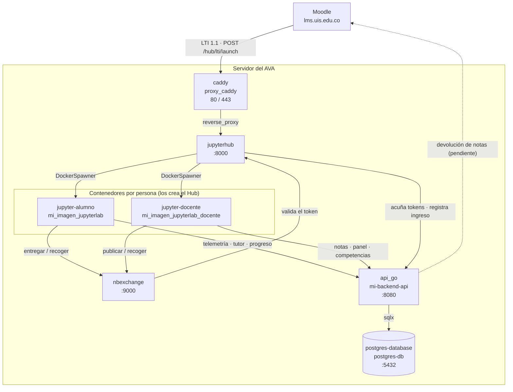

# Arquitectura del AVA

Cómo encajan las piezas y por qué están así. Lo que aquí se documenta sale de
leer el código; donde el código y lo esperable no coinciden, se dice
explícitamente.

## 1. Los servicios



Nada de lo que hay dentro del servidor se publica salvo Caddy. El backend, el
Hub, el intercambio y la base **no** exponen puertos al exterior.

> **Por qué importa.** Publicar un puerto en Docker se salta el cortafuegos del
> sistema: Docker escribe sus reglas de iptables antes que las de `ufw`. Se
> descubrió con el backend respondiendo desde internet en el 8080 con `ufw`
> activo y bien configurado. La defensa real es no publicar el puerto, no
> confiar en el cortafuegos.

## 2. Las dos redes

Definidas en `docker-compose.yml`:

| Red | Quién está dentro | Por qué |
|---|---|---|
| `moodle_jupyter_net` | caddy · jupyterhub · nbexchange · api_go · **los contenedores de alumno y docente** | Es la red por la que se hablan por nombre de servicio (`api_go:8080`, `nbexchange:9000`) |
| `backend_db_net` | api_go · postgres-database | `internal: true` — **sin salida a internet** |

`api_go` está en las dos: es el único puente entre lo que tocan los estudiantes
y la base de datos.

**El Hub no está en `backend_db_net` a propósito.** No tiene por qué poder
hablarle a la base directamente; solo al backend. Si algún día el Hub se ve
comprometido, no llega a los datos.

El nombre de la red que usa el spawner viene de `DOCKER_NETWORK_NAME`:

```python
network_name = os.environ.get('DOCKER_NETWORK_NAME', 'bridge')
c.DockerSpawner.network_name = network_name
```

## 3. Autenticación LTI 1.1

### El lanzamiento

Moodle hace un `POST` firmado con OAuth 1.0a a
`https://<dominio>/hub/lti/launch`. La firma se calcula sobre la URL completa,
así que **el protocolo importa**: si Caddy le dice al Hub que la petición llegó
por `http`, el Hub reconstruye la URL como `http://…`, la firma no cuadra y
Moodle recibe `401 Invalid oauth_signature`. Por eso, detrás de un túnel:

```caddyfile
reverse_proxy jupyterhub:8000 {
    header_up X-Forwarded-Proto https
}
```

El síntoma de olvidarlo es una actividad en blanco en Moodle, sin explicación.

### El autenticador y el rol

`LTIRoleAuthenticator` (en `hub_config/jupyterhub_config.py`) extiende
`LTI11Authenticator` y hace tres cosas:

```python
es_instructor = any(
    rol in roles for rol in ['instructor', 'teachingassistant', 'admin']
)
```

1. Decide si es instructor según el claim `roles` del LMS.
2. Lo marca como admin del Hub si lo es — nbgrader lo exige para el formgrader.
3. Lo mete en el grupo `formgrade-<curso_id>` o `nbgrader-<curso_id>`.

La identidad es el **correo**: `c.LTI11Authenticator.username_key =
'lis_person_contact_email_primary'`. Sin el correo compartido en la
configuración de privacidad de Moodle, el AVA no sabe quién entró.

### Cuando cambia el rol, se tira el contenedor

Si el rol de Moodle cambió desde el último ingreso, el autenticador **fuerza el
borrado del contenedor**. No es comodidad, es seguridad:

> El Hub, al ver un servidor ya corriendo, redirige a él sin volver a hacer
> spawn: nunca llega a ejecutarse `auth_state_a_env`, así que el contenedor
> sigue con el rol, los montajes y las variables del ingreso anterior. El
> contenedor de instructor monta `nbgrader_shared` en lectura-escritura —las
> soluciones y los envíos de todo el curso—, así que un docente que luego entra
> como estudiante se los lleva puestos.

El rol anterior se lee de `usuario.admin`, que vive en la base del Hub y
sobrevive a un reinicio.

### El `auth_state_hook`

`c.Spawner.auth_state_hook = auth_state_a_env` corre **en cada spawn**, con el
`auth_state` descifrado del lanzamiento LTI. Es donde se decide todo lo que
distingue a un contenedor de otro.

Variables que inyecta en el contenedor:

| Grupo | Variables |
|---|---|
| Identidad | `ALUMNO_ID` · `ALUMNO_NOMBRE` · `ALUMNO_EMAIL` · `ALUMNO_ROL` · `CURSO_ID` · `CURSO_NOMBRE` |
| Telemetría | `STUDENT_METRICS_TOKEN` · `STUDENT_METRICS_API_BASE` · `STUDENT_METRICS_API_URL` · `ENVIAR_AL_BACKEND` |
| Docente | `METRICS_DOCENTE_TOKEN` |
| Notas a Moodle | `LTI_RESULT_SOURCEDID` · `LTI_OUTCOME_SERVICE_URL` |
| Tutor | `TUTOR_API_BASE` · `TUTOR_IA_HABILITADO` · `TUTOR_MAX_PREGUNTAS` |
| Intercambio | `NBEXCHANGE_URL` |
| Jupyter | `JUPYTERHUB_SINGLEUSER_APP` |

Y elige imagen y volúmenes según el rol:

```python
spawner.image = (IMAGEN_DOCENTE if es_instructor else IMAGEN_ALUMNO)

if es_instructor:
    spawner.volumes = dict(volumen_trabajo, **{
        'nbgrader_shared': '/srv/nbgrader',
    })
else:
    spawner.volumes = dict(volumen_trabajo)
```

**Las plantillas con soluciones solo viajan en la imagen del docente.** Mientras
vivieron en la imagen común, un alumno podía leerlas con un `open()` desde una
celda: su kernel corre como el mismo usuario que las posee.

### El token de métricas

En cada spawn, el Hub le pide al backend un token acotado a esa persona y ese
curso:

```python
url = os.environ.get('METRICS_MINT_URL',
                     'http://api_go:8080/internal/lti/mint-metrics-token')
payload = {
    'estudiante_id': str(auth_state.get('user_id', '')),
    'curso_id': curso_id,
    'cuadernillo_codigo': cuadernillo_codigo,
    'rol': rol,
}
```

Así la identidad de cada evento la pone el servidor, no el navegador. Un alumno
no puede mandar telemetría a nombre de otro aunque manipule el `fetch`.

Al docente se le entrega un token con `rol='docente'`, que abre además las rutas
`/internal` **de su curso**. Antes recibía el token maestro, que abría las de
todos los cursos.

### El trabajo del alumno vive en un volumen

```python
volumen_trabajo = {'ava-trabajo-{username}': '/home/jovyan/work'}
```

El contenedor es desechable (`c.DockerSpawner.remove = True`); el trabajo no.

> Hasta que se puso el volumen, lo único que conservaba el semestre era que
> nadie borrara el contenedor. Un `docker system prune` —una limpieza
> rutinaria— se llevaba el curso entero por delante.

## 4. Del cuadernillo al alumno

El camino completo, y no es corto:

```mermaid
flowchart LR
    G["semana_NN/generador.py"] -->|build.py| I["notebook_semana/<br/>semana_NN/cuadernillo.ipynb"]
    I -->|docker build| IM["/opt/plantillas/ en la imagen"]
    IM -->|entrypoint.sh<br/>rol instructor| S["nbgrader source/"]
    S -->|formgrader: Generate| R["nbgrader release/"]
    R -->|publicar-cuadernillo| X["nbexchange"]
    X -->|entregar-cuadernillo<br/>rol estudiante| W["work/semana_NN.ipynb"]
```



Cuatro cosas que condicionan todo el diseño:

**Al alumno le llega un solo archivo.** `entregar-cuadernillo` copia el `.ipynb`
y nada más: no hay imágenes, ni módulos, ni `requirements.txt` al lado. Por eso
los diagramas van incrustados como SVG y el motor del cuadernillo va incrustado
como código en la primera celda.

**El nombre de la carpeta es el identificador.** `semana_01` es el
`assignment_id` en el intercambio, y de ahí pasa a `CUADERNILLO_CODIGO`, que es
la clave con la que el tutor cuenta las cinco preguntas y con la que se etiqueta
toda la telemetría. Renombrarla rompe las tres cosas.

**El cuadernillo activo lo decide nbgrader, no el backend.** Es el último que el
docente liberó en el intercambio y que esté dentro de su ventana de tiempo.

**Las semanas se siembran solas.** El `entrypoint.sh` del contenedor del docente
copia a `source/` lo que falte de `/opt/plantillas`. Basta con que el docente
entre una vez tras actualizar la imagen.

## 5. Cookies y el marco de Moodle

El AVA se ve dentro de un `iframe` de Moodle, así que para el navegador es un
sitio ajeno dentro de otro. Sus cookies necesitan `SameSite=None; Secure`, tanto
en el Hub como en el servidor de cada alumno:

```python
_MARCO = {'SameSite': 'None', 'Secure': True}
c.ServerApp.cookie_options = dict(_MARCO)
```

Y Caddy tiene que quitar `X-Frame-Options` y declarar quién puede embeber:

```caddyfile
header {
    -X-Frame-Options
    Content-Security-Policy "frame-ancestors 'self' {$AVA_MOODLE:https://lms.uis.edu.co}"
}
```

> **Límite conocido, no resuelto.** Safari, y Chrome cuando el usuario bloquea
> cookies de terceros, **no entregan ninguna cookie ajena dentro de un marco**,
> ni con `SameSite=None`. Esos estudiantes no entran, y el error que ven no
> explica nada. La mitigación es configurar la actividad de Moodle para que abra
> en «Ventana nueva». No está verificado en el ambiente real.

## 6. XSRF: la trampa que ha mordido tres veces

En los servidores de alumno (jupyter_server 1.24 + JupyterHub 5.5), un `POST`
que lleva el token `_xsrf` **en el cuerpo** falla siempre con un `403` **sin
mensaje** y sin ninguna línea en el log.

La causa: JupyterHub resuelve la identidad de la cookie en
`HubOAuth._get_user_cookie`, que vuelve a correr el chequeo XSRF y **se traga el
error** —lo deja en nivel debug— devolviendo «sin usuario». Después
`@web.authenticated` lanza un `HTTPError(403)` pelado.

**La regla: el token va en la cabecera `X-XSRFToken` o en la query string,
nunca solo en el cuerpo.** Un 403 *con* mensaje en el log es un XSRF de verdad;
un 403 *sin* mensaje y con el usuario vacío en el log de acceso es este caso.

## 7. Inconsistencias detectadas

Se listan en vez de disimularlas.

1. **`database/schema.sql` (v1) está en el repositorio pero no se usa.** El
   compose monta `schema_v2.sql`. El v1 quedó como traza histórica; leerlo
   creyendo que es el esquema vigente lleva a error.
2. **No hay zona horaria configurada** en ningún servicio. Todas las columnas de
   tiempo son `TIMESTAMPTZ`, que guarda un instante absoluto, así que no hay
   ambigüedad en el dato — pero `received_at` se sella con `time.Now()` del
   contenedor del backend, cuya zona depende del host. Ver
   [API.md](API.md#4-zonas-horarias).
3. **La devolución de notas a Moodle está a medias.** Los dos datos que hacen
   falta se capturan y se persisten: el `auth_state_hook` los pone en el
   contenedor (`LTI_RESULT_SOURCEDID`, `LTI_OUTCOME_SERVICE_URL`) y
   `estudiantesRepository.go` los guarda en la tabla `estudiantes`. La columna
   `cuadernillo_notas.enviado_a_moodle_en` existe y `notasRepository.go` la
   protege explícitamente de sobrescrituras. **Pero no se encontró ningún código
   que haga el `POST` de `replaceResult` al servicio de resultados de Moodle**,
   ni nada que escriba esa columna. Es decir: la infraestructura está puesta y
   el último paso falta. Por eso la flecha del diagrama va punteada.
4. **El intérprete de pseudocódigo no maneja listas ni el ciclo `Para`.** Solo
   conoce variables sueltas y `Mientras` (ver `pseudo_uis._INSTRUCCIONES`). Los
   cuadernillos lo respetan, pero es un límite del motor que no está declarado
   en su propia documentación.
