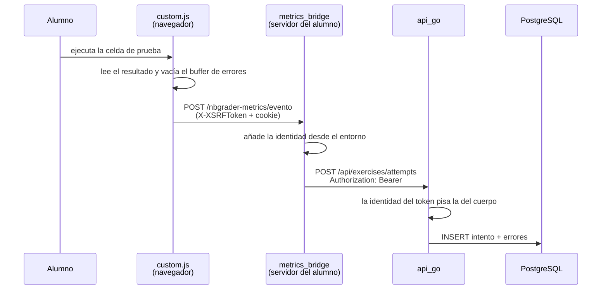

# El pipeline de telemetría

De la celda que ejecuta el alumno a la fila en PostgreSQL. Cinco saltos, y en
cada uno hay una decisión que conviene entender antes de tocar nada.



## 1. `custom.js`, en el navegador

Vive en `notebook/custom.js` y lo carga nbclassic en cada notebook. No es una
extensión de navegador: es el `custom.js` del propio Jupyter clásico.

### Qué celdas mira

Todo se decide con los **metadatos de nbgrader**, no con etiquetas ni patrones
de comentario:

```js
// La celda de PRUEBA es la que nbgrader califica. grade_id = "test_ejercicio_1".
function es_celda_de_prueba(cell) {
    var m = meta_nbgrader(cell);
    return !!(m && m.grade === true && m.grade_id);
}

// La celda de SOLUCIÓN es donde escribe el alumno. grade_id = "ejercicio_1".
function es_celda_de_solucion(cell) {
    var m = meta_nbgrader(cell);
    return !!(m && m.solution === true && m.grade !== true && m.grade_id);
}
```

Los dos `grade_id` se normalizan al mismo código de ejercicio:

```js
function normalizar_codigo_ejercicio(grade_id) {
    return grade_id.indexOf('test_') === 0 ? grade_id.slice(5) : grade_id;
}
```

Es idéntico a lo que hace la exportación de nbgrader, así que los dos caminos
—telemetría en vivo y calificación posterior— hablan del mismo ejercicio.

**Quien construye esas dos celdas es `constructor.Cuadernillo.ejercicio()`.** No
hay que replicar el mecanismo a mano: usar el constructor ya deja los metadatos
correctos.

### Qué captura, y de dónde

| Evento | De dónde sale |
|---|---|
| Error en la celda de **solución** | Se **bufferiza**: es el error real del alumno mientras trabaja |
| Ejecución de la celda de **prueba** | Cierra el intento: arma el payload y lo envía |
| Cierre de la pestaña | Vuelca los errores de ejercicios que nunca se validaron |

Los errores se acumulan en `localStorage`, con una clave por notebook:
`nbgrader-metrics:<notebook_path>`. Sobreviven a recargar la página.

### El payload del intento

```js
var payload = {
    tipo_evento: "exercise_attempt",
    cuadernillo: codigo_cuadernillo(),
    exercise_id: cod,
    codigo_celda: grade_id,
    orden: obtener_orden_celda(cell),
    puntos_maximos: nbgrader_meta.points || 1,
    attempt_at: new Date(ahora).toISOString(),
    validation_result: exito ? "passed" : "failed",
    errors: errores_acumulados
};
```

Y cada error dentro de `errors`:

```js
estado.errores[cod].push({
    cell_id: cell.metadata.nbgrader.grade_id,
    timestamp: new Date().toISOString(),
    error_type: err.tipo_error,
    error_message: err.mensaje,
});
```

> **Lo que el navegador NO manda: la identidad.** No hay `student_id`,
> `course_id` ni `cuadernillo_id` en el payload. Los pone el servidor. El
> comentario del código lo dice sin rodeos: *«La identidad la agrega
> metrics_bridge desde el contexto LTI, NO el cliente»*. Tampoco manda el número
> de intentos: eso lo cuenta el backend contando eventos. `attempts_count` en el
> cliente existe solo para la tarjeta visual.

### El buffer y el reintento

Esta parte tiene una historia y por eso está como está:

```js
enviar_evento(payload, function () {
    // El puente no lo aceptó: los errores vuelven al buffer, delante de
    // los que hayan llegado mientras tanto, y viajan con el siguiente
    // intento (o con el volcado al cerrar). Antes se vaciaba el buffer
    // antes de saber si llegó, y un 403 o un 502 los perdía para siempre.
    estado.errores[cod] = errores_acumulados.concat(estado.errores[cod] || []);
    guardar_estado(estado);
});
```

**No hay reintento automático.** Los errores que no llegaron viajan con el
siguiente intento del mismo ejercicio, o con el volcado al cerrar la pestaña. No
se reenvían solos.

### El volcado al cerrar

Si el alumno cierra la pestaña con errores de un ejercicio que **nunca validó**,
se envían igual con `validation_result: "sin_validar"`. `sendBeacon` es lo único
confiable durante `unload`.

Como `sendBeacon` no admite cabeceras, el token XSRF va en la URL:

```js
var url = base_url + 'nbgrader-metrics/evento?_xsrf=' +
          encodeURIComponent(cookie_xsrf());
```

> Antes el endpoint estaba **eximido** del chequeo XSRF, y eso dejaba entrar
> POST anónimos a nombre del alumno.

### El token XSRF, en la cabecera

```js
return fetch(base_url + 'nbgrader-metrics/evento', {
    method: 'POST',
    credentials: 'same-origin',
    headers: {
        'Content-Type': 'application/json',
        'X-XSRFToken': xsrf,
    },
    body: JSON.stringify(payload),
})
```

**Nunca en el cuerpo.** Un `_xsrf` que solo va en el cuerpo hace que JupyterHub
descarte la identidad de la cookie y devuelva un `403` sin mensaje y sin log.
Ver [ARCHITECTURE.md §6](ARCHITECTURE.md#6-xsrf-la-trampa-que-ha-mordido-tres-veces).

También ojo con la URL base: se toma de `Jupyter.notebook.base_url`, no relativa.
Una URL relativa se resolvía contra `/user/xxx/notebooks/work/…` y la petición
nunca llegaba a la ruta del puente.

### El arranque del motor

Aparte de la telemetría, `custom.js` hace dos cosas con las celdas de
andamiaje —las etiquetadas `ava-motor` y `ava-oculta`—:

1. **Las esconde** al abrir el notebook, para que nadie lea las respuestas de
   los quices antes de pensarlas.
2. **Ejecuta la del motor sola** en cuanto el kernel está listo.

Lo segundo es consecuencia de lo primero: mientras no se ejecutaba sola, el
alumno abría el cuadernillo, veía como primera celda `iniciar()`, la corría y
recibía `NameError: name 'iniciar' is not defined` en la primera cosa que hacía
en el curso — sin forma de saber que faltaba algo, porque lo que faltaba estaba
oculto. Le pasó a una clase entera.

## 2. `metrics_bridge`, en el servidor del alumno

Extensión de `jupyter_server` (`notebook/metrics_bridge.py`) que registra la
ruta `<base_url>/nbgrader-metrics/evento`.

Hace tres cosas y ninguna es cosmética:

**Pone la identidad.** Desde el entorno que inyectó el `auth_state_hook`:

```python
IDENTIDAD = {
    "student_id": os.environ.get("ALUMNO_ID"),
    "student_name": os.environ.get("ALUMNO_NOMBRE"),
    "student_email": os.environ.get("ALUMNO_EMAIL"),
    "course_id": os.environ.get("CURSO_ID"),
    "cuadernillo_id": os.environ.get("CUADERNILLO_CODIGO")
                      or os.environ.get("CUADERNILLO_ID"),
}
```

**Pone el token.** `STUDENT_METRICS_TOKEN` nunca llega al navegador. Si el HTML
consultara el backend por su cuenta, habría que entregarle ese token a la página
y cualquiera podría leerlo desde la consola.

**Rutea por tipo de evento:**

```python
"exercise_attempt": "/api/exercises/attempts",
"cuadernillo_rating": "/api/cuadernillos/ratings",
```

`tipo_evento` es solo el discriminador de ruteo; no forma parte del cuerpo que
recibe el backend.

### El interruptor que apaga todo

```python
if os.environ.get("ENVIAR_AL_BACKEND", "false").lower() not in ("true", "1", "yes"):
    log.info("[metrics_bridge] simulación: '%s' no se envió:\n%s", ...)
    return True
```

En modo simulación el puente **devuelve éxito** sin enviar nada. El navegador lo
da por bueno y vacía su buffer, el alumno no ve ningún error, y el aviso queda
en el log del contenedor, que nadie mira.

> Se puede perder un curso entero sin una sola señal. Por eso el valor por
> defecto es `true` en las tres capas —compose, spawner y `.env.example`— y el
> instalador avisa si lo encuentra apagado.

## 3. `api_go`, el backend

Recibe en `/api/exercises/attempts` con `Authorization: Bearer <token>`.

**La identidad del token pisa la del cuerpo:**

```go
studentID, courseID := middleware.IdentidadVerificada(c)
if studentID == "" {
    studentID = input.StudentID
}
if courseID == "" {
    courseID = input.CourseID
}
```

Solo cae al cuerpo si el token no traía identidad, que ocurre cuando
`METRICS_TOKEN_SECRET` está vacío. Con el secreto puesto, el cuerpo no decide
nada.

Después inserta el intento y sus errores en una transacción: `exercise_attempts`
y `attempt_errors` con `ON DELETE CASCADE`.

## 4. Cómo comprobar que funciona

**En el navegador.** La consola dice qué pasó:

```
[nbgrader-metrics] listo: telemetría por intento (errors[] acumulados + rating de cuadernillo)
[nbgrader-metrics] el puente no aceptó el evento (HTTP 403)
[nbgrader-metrics] sin cookie _xsrf: el puente va a rechazar el evento
```

**En el contenedor del alumno.** Si aparece esto, la telemetría está apagada:

```
[metrics_bridge] simulación: 'exercise_attempt' no se envió:
```

**En el backend.**

```bash
docker logs mi-backend-api | grep exercises/attempts
```

**En la base.**

```sql
SELECT student_id, cuadernillo_id, exercise_id, validation_result,
       attempt_at AT TIME ZONE 'America/Bogota' AS cuando
FROM exercise_attempts
ORDER BY received_at DESC
LIMIT 20;
```

## 5. Pruebas

| Suite | Qué cubre |
|---|---|
| `backend/tests/telemetria/prueba_customjs.js` | El cliente: qué se envía, qué se bufferiza, qué pasa con un 403 o un fallo de red |
| `backend/tests/telemetria/prueba_puente.py` | El puente: identidad, token, modo simulación |
| `backend/tests/telemetria/prueba_backend.py` | El backend: validaciones, UPSERT, casos límite |

```bash
node backend/tests/telemetria/prueba_customjs.js
```

## 6. Lo que no cubre

- **No hay reintento en segundo plano.** Un error que no llegó espera al
  siguiente intento del mismo ejercicio o al cierre de la pestaña.
- **Los errores de exploración no se registran.** Una celda sin metadatos de
  nbgrader que falla no genera ningún evento: se asume que el alumno está
  probando cosas.
- **`attempt_at` lo sella el navegador.** Si el reloj del portátil está
  desviado, el dato lo está. `received_at`, que sella el backend, es el que sirve
  para ordenar con confianza.
